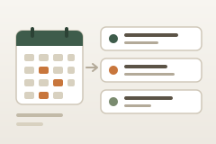

<p align="center">
  
</p>

# Local Events Finder

<p align="center">
  <a href="https://boweiliu.github.io/open-in-minds/?git_url=https://github.com/vitoprasad/local-events-finder-mind"></a>
</p>

Didn't work? Create a Mind workspace and paste this to your agent:
` /use-template https://github.com/vitoprasad/local-events-finder-mind`

## Why you care

Finds a few local events you would actually turn up to, chosen from your own calendar rather than a questionnaire.

You are not short of things to do. You are short of things you will actually
show up to.

Every events app competes on helping you *find* stuff, and finding was solved
years ago -- Partiful, Luma and Eventbrite publish more than anyone can read.
The gap is further along: you RSVP to three things in a month and go to none.
This is built for that gap. It asks you nothing, reads what you already do, and
hands you three events you would plausibly turn up to -- favouring the ones that
repeat, because the cure for a thin week is seeing the same faces again, not
attending more things once.

## How to use it

Ask your Mind what's on, and it runs this. Or run it yourself:

```bash
cd .agents/skills/local-events-finder/scripts
uv run --project ../../../.. python find_events.py --region sf
```

```
Stylized Figure Drawing: 2 Day Workshop
  Sun Oct 4, 11:00am | Inner Mission
  https://partiful.com/e/HMfkVLDffK4PK9GR5pV6
  - Matches what you already do: market
  - Small enough room that you would actually get talked to
  - About 1 miles away
```

| Flag | |
|---|---|
| `--region` | `sf`, `nyc`, `la`, `dc` (default `sf`) |
| `--window-days` | how far ahead to look (default 10) |
| `--count` | how many to surface (default 3) |
| `--home-latitude` / `--home-longitude` | turns on the distance filter |
| `--max-distance-miles` | default 12; needs a home coordinate to do anything |
| `--json` | everything, including what was rejected and why |

**What it does before showing you anything:** works out your city and free time
from your calendar; pulls public listings from Partiful and Luma; collapses
anything appearing on both; and drops what is sold out, too far, clashing with
something already in your diary, or that you turned down last time. Whatever
survives is ranked, and each pick comes with the reason it was chosen.

It keeps every raw listing on disk, so changing how results are judged never
means fetching again. It needs read-only access to your Google Calendar and
nothing else -- no payment, no other accounts, no logins for the event sites.

## Ideas for making it yours

- **Make it come to you.** As published it only runs when asked. A weekly
  scheduled run that messages you one good option, unprompted, is the change
  that turns it from a tool into something that brings you plans.
- **Close the loop after the event.** Ask "how was it?" the next day and record
  the answer. Attendance is the only number that matters here, and nothing
  currently measures it.
- **Add a source your city actually uses.** Partiful covers four metros. A
  local listings site, a university calendar, or a venue's own feed slots in
  alongside the two existing readers.
- **Deepen the matching.** It is word overlap today, so it misses connections a
  person would spot instantly. Letting a model read your calendar and the
  listings would catch them, at a per-run cost.
- **Bring a friend into it.** Going alone is the real reason people skip
  things. Surfacing "someone else is going who also knows nobody" attacks the
  actual bottleneck rather than the solved one.

## What this is

This repository is a published **minds template**: a clean, bootable
snapshot of what a mind built, ready to adapt into your own. It is NOT the
generic workspace template -- it is this specific project.

[`template.md`](template.md) is the full manifest -- what it is, how it
works, what it needs to run, and what to adapt -- with the
machine-readable half (recipe, requirements, and the environment it needs
installed) in [`template.toml`](template.toml).
